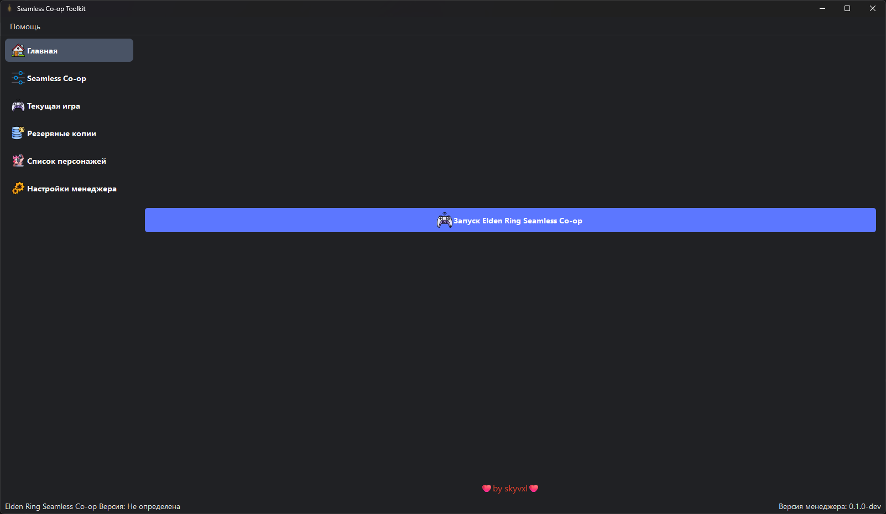
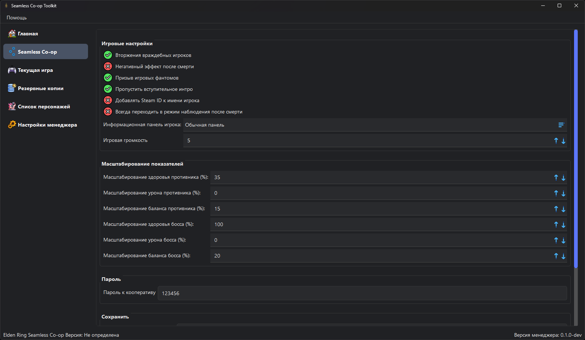
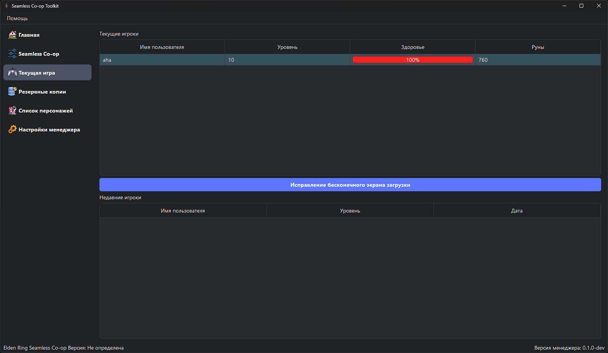
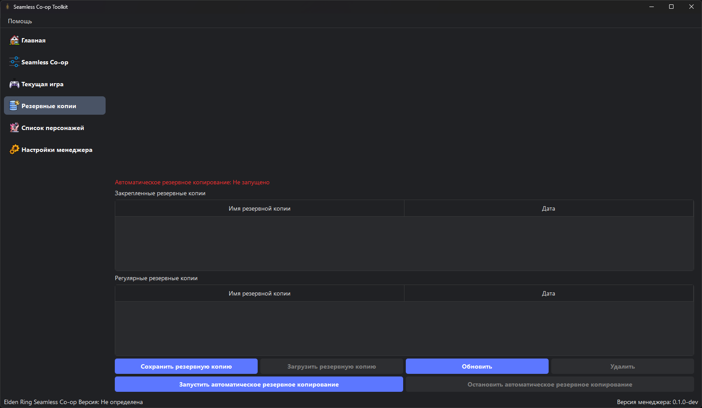
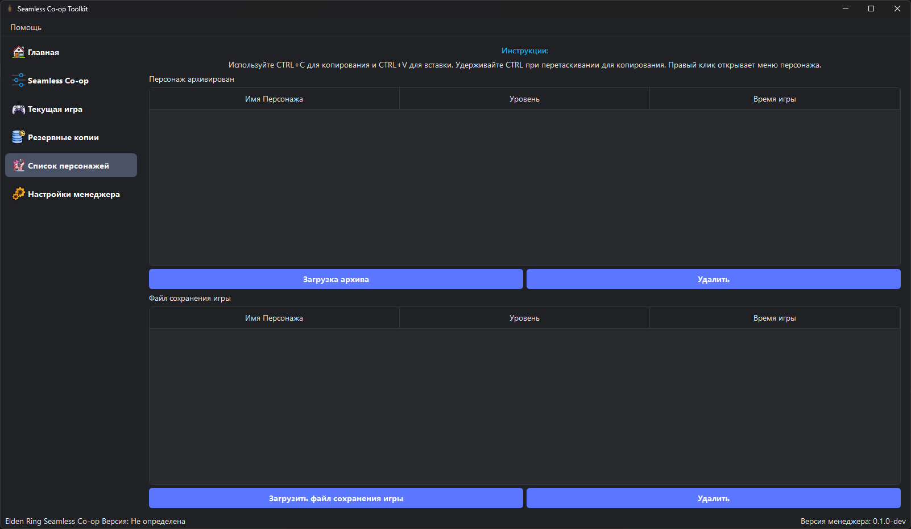
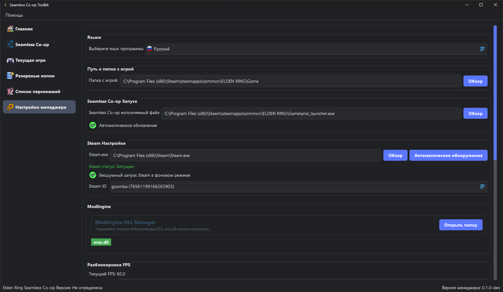
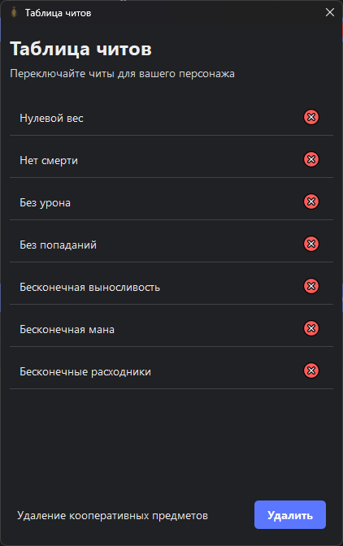
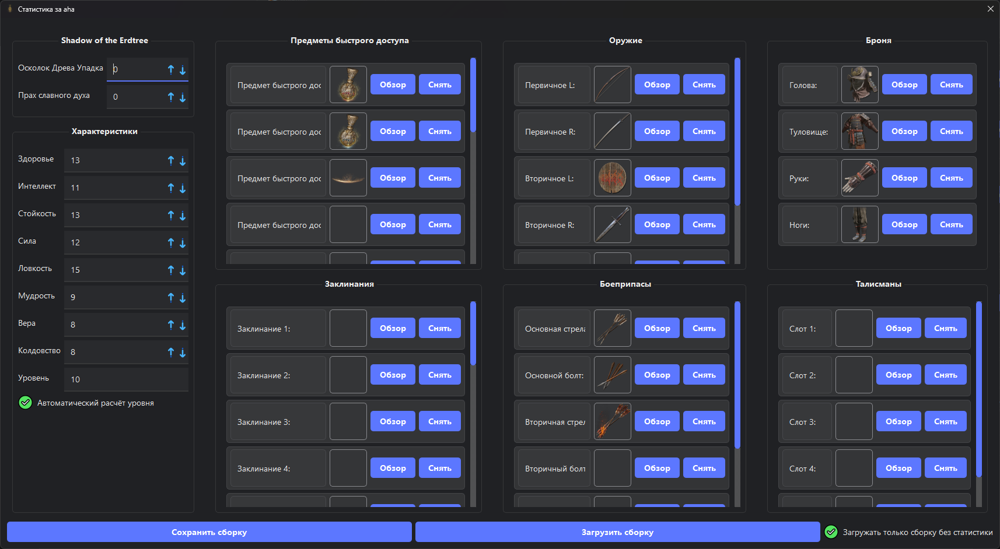

# Seamless Co-op Toolkit

A Windows desktop toolkit for Elden Ring Seamless Co-op, rebuilt with PySide6.

The current development milestone reconstructs the application interface. Game
launching, save management, memory editing, backups, and updates are not active
yet.

## User interface

The screenshots below show what the program looks like now. I restored this
interface using old versions of Seamless Co-op Mod Manager (SCMM) by **2Pz** as
a reference. Some parts may change during development.

### Main screen



### Seamless Co-op settings



### Current game



### Save backups



### Character manager



### Toolkit settings



### Cheat table



### Player stats and equipment



## Development

```powershell
uv sync --dev
uv run sct
uv run python -m unittest discover -s tests -v
```

## Credits

This project continues work based on Phantom Toolkit by **2Pz**.

See [`LICENSE`](LICENSE).
